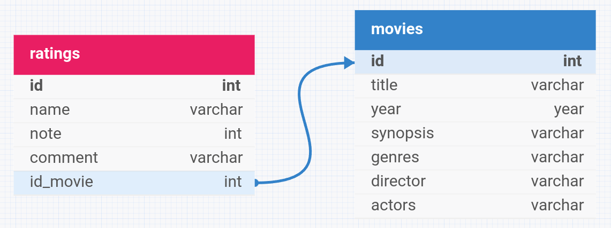

<h1 align="center" style="font-weight: bold">api filmes 🎥</h1>



## Descrição 📜

Prova de Aptidão Técnica – Tracking HighEnd(THE).

Esse projeto consiste em uma aplicação que busca filmes na api do [OMDB](https://www.omdbapi.com/) e registra no banco de dados (MySQL), com o objetivo de centralizar dados sobre filmes e também avaliações feitas por usuários.

## Melhorias 📈

- Adicionar avaliação para um filme através do título.
- Adicionar autenticação para avaliadores.

## Tecnologias 🖥️

Este projeto está utilizando as seguintes tecnologias:

- [Node.js](https://nodejs.org/en)
- [TypeScript](https://www.typescriptlang.org/)
- [Docker](https://docker.com)
- [Express](https://www.expressjs.com/pt-br/)
- [MySQL2](https://sidorares.github.io/node-mysql2/pt-BR/docs)
- [Vitest](https://vitest.dev/)
- [Zod](https://zod.dev/)

## Endpoints 📌

### Filmes

- **GET** `/movies`: lista todos os filmes.
- **GET** `/movies/title?title=`: lista filmes buscando pelo título (query param).
- **GET** `/movies/:id`: lista um filme buscando pelo id.
- **POST** `/movies`: cria um novo filme.
- **PATCH** `/movies/:id`: atualiza alguns campos de um filme, buscando pelo id.
- **DELETE** `/movies/:id`: deleta um filme.

### Avaliações

- **GET** `/ratings`: lista todas as avaliações.
- **GET** `/ratings/:id`: lista uma avaliação buscando pelo id.
- **POST** `/ratings`: cria uma nova avaliação.
- **PATCH** `/ratings/:id`: atualiza alguns campos de uma avaliação, buscando pelo id.
- **DELETE** `/ratings`: deleta uma avaliação.

## Como rodar esse projeto? 💿

<h3>Pre-requisitos</h3>

- [Docker](https://www.docker.com/)
- [Git](https://git-scm.com/)
- [Github](https://github.com/)

<h3>Clonagem</h3>

```bash
# clone o repositório
$ git clone https://github.com/bastosmatheus/teste-the.git
```

<h3>Configuração do arquivo .env</h3>

```bash
# arquivo .env
MYSQL_PORT=
MYSQL_HOST=
MYSQL_USER=
MYSQL_PASSWORD=

MYSQL_DATABASE=
MYSQL_ROOT_PASSWORD=

API_KEY=

PORT=
```

<h3>Projeto</h3>

```bash
# depois de clonado, procure a pasta do projeto
$ cd teste-the

# instale as dependências
$ npm install

# execute o comando docker
$ docker-compose up
```
